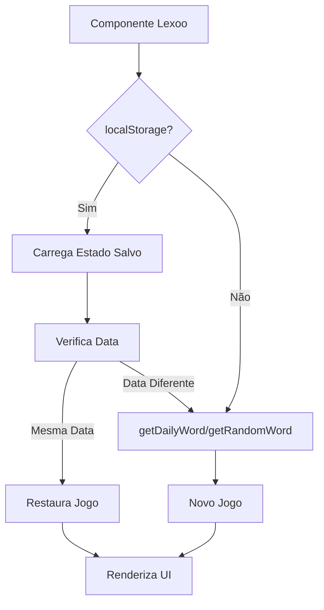

# Documentação Interna - Mini Game LEXOO

## 📋 Índice

1. [Visão Geral](#visão-geral)
2. [Arquitetura do Projeto](#arquitetura-do-projeto)
3. [Estrutura de Arquivos](#estrutura-de-arquivos)
4. [Fluxo de Dados](#fluxo-de-dados)
5. [Componentes Principais](#componentes-principais)
6. [Sistema de Palavras](#sistema-de-palavras)
7. [Modos de Jogo](#modos-de-jogo)
8. [Persistência de Dados](#persistência-de-dados)
9. [Sistema de Estatísticas](#sistema-de-estatísticas)
10. [Guia de Manutenção](#guia-de-manutenção)
11. [Troubleshooting](#troubleshooting)

---

## 🎮 Visão Geral

**LEXOO** é um jogo de palavras educativo inspirado no Wordle, desenvolvido em React/TypeScript para a plataforma Simulavest. O jogo desafia os usuários a descobrir palavras de 5 letras em português, oferecendo dois modos distintos de jogo.

### Características Principais

- **Dois modos de jogo**: Classic (LEXOO) e Dulex (duas palavras simultâneas)
- **Vocabulário rico**: 255+ palavras estáticas com definições educativas
- **Sistema de vidas**: Representação visual com corações
- **Persistência**: Salva progresso e estatísticas no localStorage
- **Responsivo**: Adaptado para mobile (teclado nativo) e desktop (teclado virtual)
- **Tema**: Suporte a dark/light mode
- **Feedback visual**: Animações de flip, shake e confetti
- **Modal 3D**: CartãoÃo flip com definições e estatísticas

---

## 🏗️ Arquitetura do Projeto

### Stack Tecnológico

```
React 18.x
TypeScript
Next.js (App Router)
Tailwind CSS
Lucide React (ícones)
Canvas Confetti (efeitos)
@andsfonseca/palavras-pt-br (validação)
```

### Padrão de Design

- **Custom Hooks**: Lógica de negócio separada em hooks reutilizáveis
- **Component Composition**: Componentes pequenos e focados
- **State Management**: React useState/useEffect (sem Redux)
- **Data Persistence**: localStorage API
- **Type Safety**: TypeScript para prevenir erros

---

## 📁 Estrutura de Arquivos

```
/lexoo
├── Lexoo.tsx                 # Componente principal e UI
├── /lib
│   └── lexooData.ts          # Banco de palavras e configurações
└── /functions
    └── lexooLogic.ts         # Hooks e lógica do jogo
    └── verificar_palavras.mjs # Validação de palavras (Node.js)
```

### Detalhamento dos Arquivos

#### `Lexoo.tsx` (1400+ linhas)
- **Responsabilidade**: Interface visual, renderização e interação
- **Componentes internos**:
  - `SplitKey`: Tecla dividida para modo Dulex
  - `Cell`: Célula individual do grid
  - `Row`: Linha de tentativas
  - `Dulex`: Grid duplo para modo Dulex
  - `GameInstance`: Instância do jogo
  - `Lexoo` (default export): Wrapper com state de modo

#### `lexooData.ts` (~1200 linhas)
- **Responsabilidade**: Dados estáticos e funções auxiliares
- **Conteúdo**:
  - Constantes de configuração
  - Banco de 255 palavras com definições
  - Interfaces TypeScript
  - Funções de seleção de palavras
  - Validação de palavras

#### `lexooLogic.ts` (~600 linhas)
- **Responsabilidade**: Lógica de negócio e gerenciamento de estado
- **Hooks exportados**:
  - `useCountdownToMidnight`: Timer até meia-noite
  - `useLexooGame`: Hook principal do jogo

#### `verificar_palavras.mjs`
- **Responsabilidade**: Script de validação (Node.js)
- **Uso**: Verifica integridade do banco de palavras
- **Comando**: `node verificar_palavras.mjs`

---

## 🔄 Fluxo de Dados

### 1. Inicialização



### 2. Ciclo de Tentativa

```
Usuário digita letra
  ↓
currentGuess atualizado
  ↓
Usuário pressiona ENTER
  ↓
Validações (tamanho, palavra válida, não repetida)
  ↓
formatGuessFor() - aplica cores
  ↓
Animação de reveal (flip)
  ↓
Atualiza keyboardStatus
  ↓
Verifica vitória/derrota
  ↓
Salva no localStorage
```

### 3. Persistência

```typescript
// Estrutura SavedGameState
{
  mode: 'classic' | 'dulex',
  solution: string,
  solutionDefinition: string,
  solutionB: string,
  solutionBDefinition: string,
  guesses: FormattedLetter[][],
  guessesB: FormattedLetter[][],
  currentGuess: string,
  isGameOver: boolean,
  turn: number,
  history: string[],
  isSolvedA: boolean,
  isSolvedB: boolean,
  keyboardStatus: Record<string, LetterStatus>,
  keyboardStatusA: Record<string, LetterStatus>,
  keyboardStatusB: Record<string, LetterStatus>,
  savedAt: string // ISO timestamp
}
```

---

## 🧩 Componentes Principais

### `Cell` - Célula Individual

**Props:**
```typescript
{
  value: string,
  status: LetterStatus, // 'initial' | 'absent' | 'present' | 'correct'
  isRevealing?: boolean,
  revealDelay?: number,
  theme: 'light' | 'dark',
  mode?: 'classic' | 'dulex'
}
```

**Cores por Status:**
- `initial`: Cinza (vazio)
- `absent`: Cinza escuro
- `present`: Amarelo/Âmbar (letra na palavra, posição errada)
- `correct`: Verde (Classic) ou Roxo (Dulex)

**Animações:**
- `animate-flip`: Giro 3D ao revelar
- `scale-105`: Hover no desktop

---

### `SplitKey` - Tecla Dividida (Dulex)

Tecla do teclado virtual dividida verticalmente:
- **Esquerda**: Status da Palavra A
- **Direita**: Status da Palavra B

**Cores:**
- Initial: Cinza neutro
- Absent: Cinza escuro
- Present: Amarelo
- Correct: Roxo (ambos lados)

---

### `Row` - Linha de Tentativas

**Tipos de Linha:**
1. **Linha Preenchida** (`guess`): Mostra tentativa anterior com cores
2. **Linha Atual** (`currentGuess`): Mostra digitação em progresso
3. **Linha Vazia**: Células vazias para tentativas futuras

---

### `Dulex` - Grid Duplo

Renderiza dois grids lado a lado (desktop) ou empilhados (mobile):
- Grid A (Palavra 1)
- Grid B (Palavra 2)

**Opacidade:**
- Palavra resolvida: `opacity-70`
- Palavra ativa: `opacity-100`

---

### Modal de Estatísticas (3D Flip Card)

**Frente (Definição):**
- Título: "VOCABULÁRIO DO DIA"
- Palavra(s) do dia
- Definição(ões) educativa(s)
- Linha decorativa

**Verso (Stats):**
- Jogos, Vitórias %, Sequência, Recorde
- Gráfico de distribuição de tentativas
- Countdown até meia-noite
- Botão "Compartilhar"

**Cores de Fundo:**
- **Vitória**: `bg-green-500` (sólido)
- **Derrota**: `bg-red-500` (sólido)
- **Em Andamento**: Tema padrão

---

## 📚 Sistema de Palavras

### Estrutura do Banco

```typescript
interface GameWord {
  word: string;        // Palavra em MAIÚSCULAS (5 letras)
  definition: string;  // Definição educativa
}
```

### Seleção de Palavras

#### `getDailyWord()` - Palavra do Dia
```typescript
// Algoritmo determinístico baseado na data
const dayOfYear = Math.floor((today - startOfYear) / 86400000);
const seed = dayOfYear + today.getFullYear() * 365;
const index = seed % GAME_WORDS.length;
return GAME_WORDS[index];
```

**Características:**
- Mesma palavra para todos os usuários no mesmo dia
- Cicla pelo banco completo antes de repetir
- Muda automaticamente à meia-noite

#### `getRandomWord()` - Palavra Aleatória
```typescript
return GAME_WORDS[Math.floor(Math.random() * GAME_WORDS.length)];
```

**Uso:**
- Modo Dulex (ambas palavras)
- Botão "Novo Jogo" (usuários PRO)

---

### Validação de Palavras

```typescript
isValidWord(word: string): boolean
```

**Processo:**
1. Converte para minúsculas
2. Verifica na biblioteca `@andsfonseca/palavras-pt-br`
3. Fallback: busca no banco estático se biblioteca falhar

**Casos Especiais:**
- Aceita palavras com acentuação
- Normaliza antes de comparar
- Ignora case sensitivity

---

### Adicionar Novas Palavras

1. **Edite `lexooData.ts`:**
```typescript
const STATIC_GAME_WORDS: GameWord[] = [
  // Adicione aqui:
  { word: 'NOVA', definition: 'Explicação educativa da palavra.' },
  // ...
];
```

2. **Execute o validador:**
```bash
node verificar_palavras.mjs
```

3. **Critérios:**
   - Exatamente 5 letras
   - Palavra deve existir em português
   - Definição clara e educativa
   - Evitar gírias, nomes próprios, termos obscenos

---

## 🎯 Modos de Jogo

### Classic (LEXOO)

**Objetivo:** Descobrir UMA palavra em 6 tentativas

**Regras:**
- 6 vidas (corações)
- Feedback colorido após cada tentativa
- Verde = posição correta
- Amarelo = letra existe, posição errada
- Cinza = letra não existe

**Vitória:**
- Todas as letras verdes
- Modal abre automaticamente
- Som de fanfarra + confetti

**Derrota:**
- 6 tentativas esgotadas
- Modal mostra a palavra correta
- Som de game over

---

### Dulex (DULEX)

**Objetivo:** Descobrir DUAS palavras em 7 tentativas

**Regras:**
- 7 vidas (corações)
- Mesma palavra conta para ambos os grids
- Feedback independente para cada palavra
- Roxo = correto (ao invés de verde)
- Teclado dividido mostra status de cada palavra

**Vitória:**
- Ambas palavras resolvidas
- Modal abre automaticamente
- Som de fanfarra + confetti

**Derrota:**
- 7 tentativas esgotadas OU
- Tempo acabou sem resolver ambas

**Estratégia:**
- Priorize palavras com letras comuns
- Use feedback de ambos os grids
- Palavra que resolve A pode não ter letras de B

---

## 💾 Persistência de Dados

### LocalStorage Keys

```typescript
// Estado do jogo
`lexoo_game_state_v2_classic`
`lexoo_game_state_v2_dulex`

// Estatísticas globais
`lexoo_game_stats`
```

### Versionamento

**`v2`** indica versão atual do formato de dados.

**Mudanças importantes:**
- `v1 → v2`: Adicionou `solutionDefinition` e `solutionBDefinition`

### Validação de Data

```typescript
// Verifica se jogo é do mesmo dia
const savedDate = new Date(state.savedAt);
const today = new Date();
const isSameDay = savedDate.toDateString() === today.toDateString();

if (!isSameDay) {
  localStorage.removeItem(key); // Limpa jogo antigo
  return null; // Inicia novo jogo
}
```

### Migração de Dados

Se precisar migrar dados antigos:

```typescript
// Exemplo: Adicionar campo novo
if (savedState && !savedState.solutionDefinition) {
  savedState.solutionDefinition = '';
  savedState.solutionBDefinition = '';
}
```

---

## 📊 Sistema de Estatísticas

### Estrutura

```typescript
interface GameStats {
  gamesPlayed: number;
  winPercentage: number;
  currentStreak: number;
  maxStreak: number;
  guessDistribution: number[]; // [0,0,0,0,0,0] (6 tentativas)
}
```

### Atualização

**Em vitória (Classic):**
```typescript
setStats(prev => {
  const newStats = {
    ...prev,
    gamesPlayed: prev.gamesPlayed + 1,
    currentStreak: prev.currentStreak + 1,
    maxStreak: Math.max(prev.maxStreak, prev.currentStreak + 1),
  };
  
  // Incrementa a barra correspondente
  newStats.guessDistribution[turn] += 1;
  
  // Recalcula porcentagem
  const wins = newStats.guessDistribution.reduce((a, b) => a + b, 0);
  newStats.winPercentage = Math.round((wins / newStats.gamesPlayed) * 100);
  
  return newStats;
});
```

**Em derrota:**
```typescript
setStats(prev => ({
  ...prev,
  gamesPlayed: prev.gamesPlayed + 1,
  currentStreak: 0, // Reset da sequência
  // winPercentage recalculado
}));
```

### Distribuição de Tentativas

O gráfico mostra:
- Barras azuis: Vitórias em cada tentativa (1-6)
- Barra vermelha: Derrotas (caveira 💀)
- Destaque verde: Última vitória

**Cálculo de largura:**
```typescript
const maxCount = Math.max(...stats.guessDistribution, lossCount);
const percentage = maxCount > 0 ? (count / maxCount) * 100 : 0;
```

---

## 🔧 Guia de Manutenção

### Ajustar Dificuldade

**Aumentar tentativas:**
```typescript
// lexooData.ts
export const MAX_GUESSES = 7; // Era 6
export const MAX_GUESSES_DUETO = 9; // Era 7
```

**Mudar tamanho da palavra:**
```typescript
export const WORD_LENGTH = 6; // Era 5
// Nota: Precisa atualizar banco de palavras
```

---

### Mudar Cores do Tema

**Classic (Verde → Azul):**
```typescript
// Cell.tsx
correct: "bg-gradient-to-br from-blue-500 to-cyan-600"
```

**Dulex (Roxo → Rosa):**
```typescript
correct: mode === "dulex"
  ? "bg-gradient-to-br from-pink-500 to-rose-600"
  : "..."
```

---

### Adicionar Novo Modo

1. **Atualize o tipo:**
```typescript
type GameMode = 'classic' | 'dulex' | 'triple';
```

2. **Adicione configuração:**
```typescript
const maxGuesses = 
  mode === 'triple' ? 10 : 
  mode === 'dulex' ? 7 : 6;
```

3. **Crie componente específico:**
```typescript
const Triple = ({ ... }) => {
  // Lógica de 3 palavras
}
```

4. **Atualize menu:**
```tsx
<button onClick={() => setMode('triple')}>
  <span className="text-orange-400">●</span>
  Triple
</button>
```

---

### Desabilitar Sons

```typescript
// Lexoo.tsx - linha ~360
useEffect(() => {
  if (showStatsModal && isGameOver) {
    // Comente estas linhas:
    // try {
    //   const audio = new Audio("/fanfare-trumpets.mp3");
    //   audio.play();
    // } catch {}
  }
}, [showStatsModal, isGameOver]);
```

---

### Alterar Tempo de Animação

```typescript
// Cell.tsx
revealDelay={i * 200} // Era 150ms (mais lento)

// Lexoo.tsx - linha ~480
setTimeout(() => {
  // ...
}, WORD_LENGTH * 200 + 500); // Era 150ms
```

---

## 🐛 Troubleshooting

### Problema: "Palavra inexistente!" para palavra válida

**Causa:** Biblioteca de validação não reconhece a palavra

**Solução:**
```typescript
// lexooData.ts - Adicione fallback
export const isValidWord = (word: string): boolean => {
  try {
    return Word.checkValid(word.toLowerCase(), WORD_LENGTH);
  } catch (error) {
    // Busca no banco estático
    return GAME_WORDS.some(w => w.word === word.toUpperCase());
  }
};
```

---

### Problema: Jogo não salva progresso

**Causa:** localStorage bloqueado ou cheio

**Debug:**
```typescript
// lexooLogic.ts - Adicione logs
const saveGameState = (state: SavedGameState) => {
  try {
    const key = getGameStateKey(state.mode);
    const json = JSON.stringify(state);
    console.log('Salvando:', key, json.length, 'bytes');
    localStorage.setItem(key, json);
  } catch (error) {
    console.error('Erro ao salvar:', error);
    alert('Não foi possível salvar o jogo. localStorage pode estar cheio.');
  }
};
```

**Solução:**
- Limpe localStorage: `localStorage.clear()`
- Verifique limites do navegador (5-10MB)

---

### Problema: Modal não abre após vitória

**Causa:** `setShowStatsModal` não executado

**Debug:**
```typescript
// lexooLogic.ts - linha ~290
if (currentGuess === solution) {
  console.log('VITÓRIA DETECTADA!');
  setIsGameOver(true);
  
  setTimeout(() => {
    console.log('Abrindo modal...');
    setShowStatsModal(true);
  }, 1500);
}
```

---

### Problema: Teclado nativo não abre no mobile

**Causa:** Input invisível perdeu foco

**Solução:**
```typescript
// Lexoo.tsx - linha ~150
onBlur={(e) => {
  if (!showStatsModal && !showHelpModal && !isGameOver) {
    setTimeout(() => {
      console.log('Refocalizando input...');
      e.target.focus();
    }, 100);
  }
}}
```

---

### Problema: Animação de flip não funciona

**Causa:** TailwindCSS não compilou a classe `animate-flip`

**Solução:**
```css
/* globals.css */
@keyframes flip {
  0% { transform: rotateX(0); }
  50% { transform: rotateX(90deg); }
  100% { transform: rotateX(0); }
}

.animate-flip {
  animation: flip 0.6s ease-in-out;
}
```

---

### Problema: Palavra do dia diferente entre usuários

**Causa:** Timezone ou relógio desincronizado

**Debug:**
```typescript
// lexooData.ts - linha ~1150
export const getDailyWord = (): GameWord => {
  const today = new Date();
  console.log('Data/Hora local:', today.toString());
  console.log('Timestamp UTC:', today.getTime());
  
  // ... resto da função
};
```

**Solução:** Use UTC ao invés de horário local:
```typescript
today.setUTCHours(0, 0, 0, 0); // Ao invés de setHours
```

---

## 📝 Notas Finais

### Boas Práticas

1. **Sempre teste** mudanças no banco de palavras com `verificar_palavras.mjs`
2. **Versione** mudanças de formato no localStorage (`v3`, `v4`, etc)
3. **Comente** lógica complexa (ex: algoritmo de cores)
4. **Mantenha** consistência nas animações e cores entre modos
5. **Teste** em mobile antes de deploy

### Performance

- Banco de 255 palavras é leve (~50KB)
- Evite adicionar milhares de palavras (impacta bundle)
- Animações usam CSS (hardware-accelerated)
- localStorage é síncrono (não abuse)

### Acessibilidade

- Cores atendem WCAG 2.1 AA (contraste mínimo)
- Labels ARIA em teclas do teclado
- Modal pode ser fechado com ESC (TODO)
- Feedback sonoro para vitória/derrota

### Roadmap (Futuras Melhorias)

- [ ] Modo "Hard": Letras corretas devem ser reutilizadas
- [ ] Tema customizável (cores)
- [ ] Ranking global (requer backend)
- [ ] Dicas (consumir 1 vida)
- [ ] Modo offline (Service Worker)
- [ ] Internacionalização (EN, ES)

---

**Última atualização:** 2025-12-12  
**Versão do formato de dados:** v2  
**Versão do mini-game:** 1.0.0